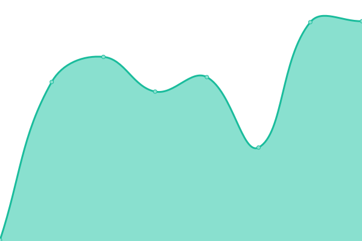
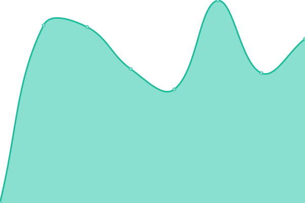

# [📈 Live Status](https://https://status.douglasneuroinformatics.ca/): <!--live status--> **🟧 Partial outage**

This repository contains the open-source uptime monitor and status page for [Douglas NeuroInformatics Platform](https://douglasneuroinformatics.ca/), powered by [Upptime](https://github.com/upptime/upptime).

With [Upptime](https://upptime.js.org), you can get your own unlimited and free uptime monitor and status page, powered entirely by a GitHub repository. We use [Issues](https://github.com/DouglasNeuroInformatics/upptime/issues) as incident reports, [Actions](https://github.com/DouglasNeuroInformatics/upptime/actions) as uptime monitors, and [Pages](https://https://status.douglasneuroinformatics.ca/) for the status page.

<!--start: status pages-->
<!-- This summary is generated by Upptime (https://github.com/upptime/upptime) -->
<!-- Do not edit this manually, your changes will be overwritten -->
<!-- prettier-ignore -->
| URL | Status | History | Response Time | Uptime |
| --- | ------ | ------- | ------------- | ------ |
|  DNP remote accesss gateway | 🟥 Down | [dnp-remote-accesss-gateway.yml](https://github.com/DouglasNeuroInformatics/upptime/commits/HEAD/history/dnp-remote-accesss-gateway.yml) | 

 0ms
     
 | 

<a href="https://status.douglasneuroinformatics.ca//history/dnp-remote-accesss-gateway">0.00%</a>
    

|  [Open Data Capture](https://demo.opendatacapture.org/auth/login) | 🟩 Up | [open-data-capture.yml](https://github.com/DouglasNeuroInformatics/upptime/commits/HEAD/history/open-data-capture.yml) | 

 387ms
     
 | 

<a href="https://status.douglasneuroinformatics.ca//history/open-data-capture">100.00%</a>
    

<!--end: status pages-->

[**Visit our status website →**](https://https://status.douglasneuroinformatics.ca/)

## 📄 License

- Powered by: [Upptime](https://github.com/upptime/upptime)
- Code: [MIT](./LICENSE) © [Anand Chowdhary](https://anandchowdhary.com), supported by [Pabio](https://pabio.com)
- Data in the `./history` directory: [Open Database License](https://opendatacommons.org/licenses/odbl/1-0/)
