# [📈 Live Status](https://https://status.douglasneuroinformatics.ca/): <!--live status--> **🟧 Partial outage**

This repository contains the open-source uptime monitor and status page for [Douglas NeuroInformatics Platform](https://douglasneuroinformatics.ca/), powered by [Upptime](https://github.com/upptime/upptime).

With [Upptime](https://upptime.js.org), you can get your own unlimited and free uptime monitor and status page, powered entirely by a GitHub repository. We use [Issues](https://github.com/DouglasNeuroInformatics/upptime/issues) as incident reports, [Actions](https://github.com/DouglasNeuroInformatics/upptime/actions) as uptime monitors, and [Pages](https://https://status.douglasneuroinformatics.ca/) for the status page.

<!--start: status pages-->
<!-- This summary is generated by Upptime (https://github.com/upptime/upptime) -->
<!-- Do not edit this manually, your changes will be overwritten -->
<!-- prettier-ignore -->
| URL | Status | History | Response Time | Uptime |
| --- | ------ | ------- | ------------- | ------ |
|  DNP Remote Access Gateway | 🟩 Up | [dnp-remote-access-gateway.yml](https://github.com/DouglasNeuroInformatics/upptime/commits/HEAD/history/dnp-remote-access-gateway.yml) | 

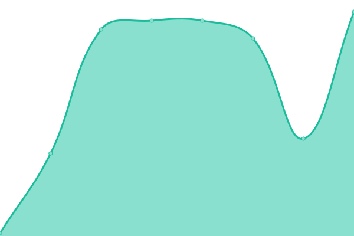 61ms
     
 | 

<a href="https://status.douglasneuroinformatics.ca/history/dnp-remote-access-gateway">100.00%</a>
    

|  [Open Data Capture Demo (front-end)](https://demo.opendatacapture.org/auth/login) | 🟩 Up | [open-data-capture-demo-front-end.yml](https://github.com/DouglasNeuroInformatics/upptime/commits/HEAD/history/open-data-capture-demo-front-end.yml) | 

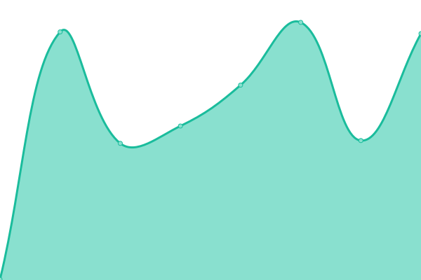 377ms
     
 | 

<a href="https://status.douglasneuroinformatics.ca/history/open-data-capture-demo-front-end">100.00%</a>
    

|  [Open Data Capture Demo (back-end)](https://demo.opendatacapture.org/api) | 🟩 Up | [open-data-capture-demo-back-end.yml](https://github.com/DouglasNeuroInformatics/upptime/commits/HEAD/history/open-data-capture-demo-back-end.yml) | 

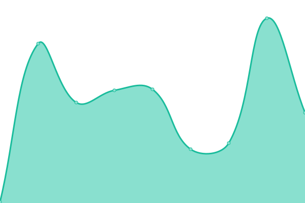 640ms
     
 | 

<a href="https://status.douglasneuroinformatics.ca/history/open-data-capture-demo-back-end">100.00%</a>
    

|  [Mouse Open Data Capture](https://mouseodc.douglasneuroinformatics.ca/auth/login) | 🟥 Down | [mouse-open-data-capture.yml](https://github.com/DouglasNeuroInformatics/upptime/commits/HEAD/history/mouse-open-data-capture.yml) | 

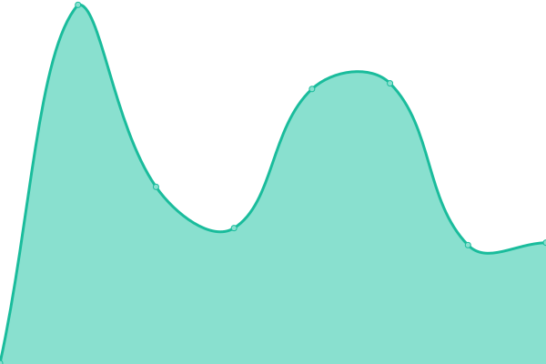 278ms
     
 | 

<a href="https://status.douglasneuroinformatics.ca/history/mouse-open-data-capture">99.99%</a>
    

|  [Data Bank (front-end)](https://databank.douglasneuroinformatics.ca/auth/login) | 🟩 Up | [data-bank-front-end.yml](https://github.com/DouglasNeuroInformatics/upptime/commits/HEAD/history/data-bank-front-end.yml) | 

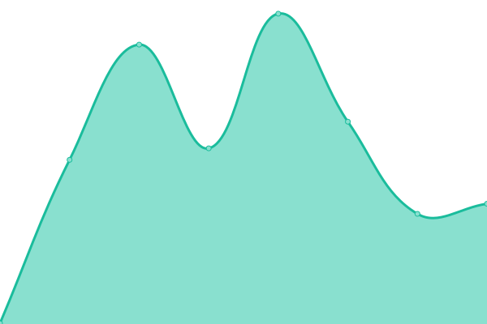 292ms
     
 | 

<a href="https://status.douglasneuroinformatics.ca/history/data-bank-front-end">100.00%</a>
    

|  [Data Bank (back-end)](https://databank.douglasneuroinformatics.ca/api) | 🟩 Up | [data-bank-back-end.yml](https://github.com/DouglasNeuroInformatics/upptime/commits/HEAD/history/data-bank-back-end.yml) | 

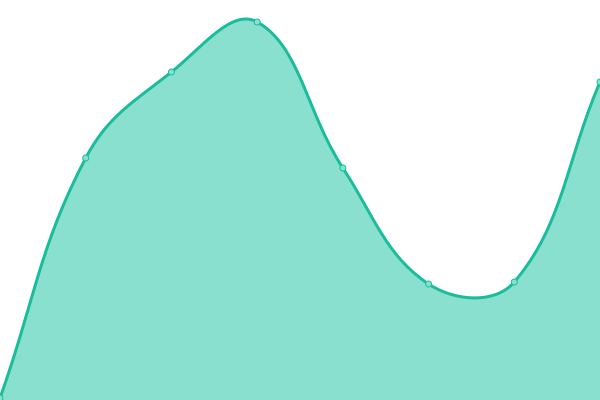 528ms
     
 | 

<a href="https://status.douglasneuroinformatics.ca/history/data-bank-back-end">100.00%</a>
    

|  [Mattermost](https://chat.douglasneuroinformatics.ca) | 🟩 Up | [mattermost.yml](https://github.com/DouglasNeuroInformatics/upptime/commits/HEAD/history/mattermost.yml) | 

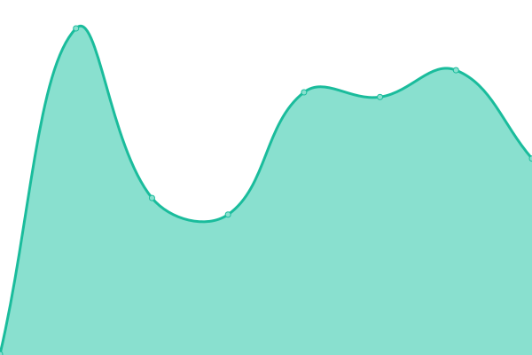 246ms
     
 | 

<a href="https://status.douglasneuroinformatics.ca/history/mattermost">100.00%</a>
    

|  [Tickets](https://support.douglasneuroinformatics.ca) | 🟩 Up | [tickets.yml](https://github.com/DouglasNeuroInformatics/upptime/commits/HEAD/history/tickets.yml) | 

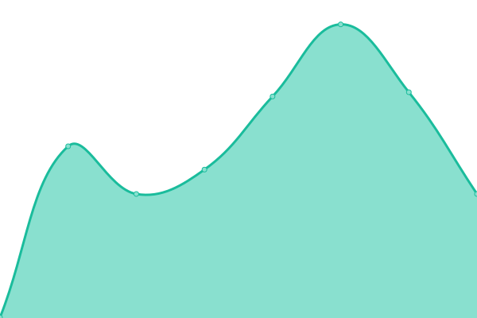 320ms
     
 | 

<a href="https://status.douglasneuroinformatics.ca/history/tickets">100.00%</a>
    

|  Douglas Research ODC | 🟩 Up | [douglas-research-odc.yml](https://github.com/DouglasNeuroInformatics/upptime/commits/HEAD/history/douglas-research-odc.yml) | 

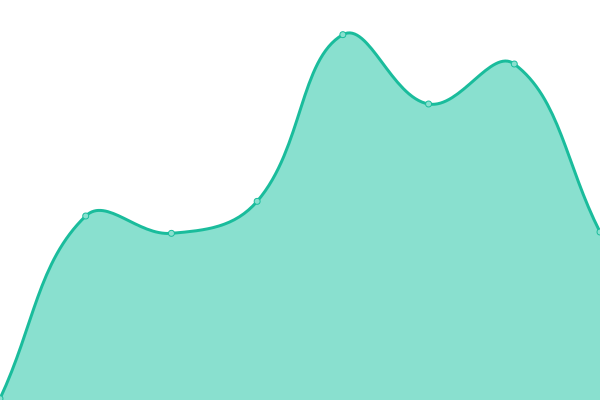 365ms
     
 | 

<a href="https://status.douglasneuroinformatics.ca/history/douglas-research-odc">100.00%</a>
    

|  Douglas Clinical ODC | 🟩 Up | [douglas-clinical-odc.yml](https://github.com/DouglasNeuroInformatics/upptime/commits/HEAD/history/douglas-clinical-odc.yml) | 

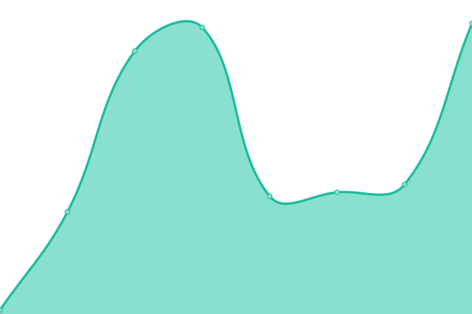 270ms
     
 | 

<a href="https://status.douglasneuroinformatics.ca/history/douglas-clinical-odc">100.00%</a>
    

|  ChatDNP | 🟩 Up | [chat-dnp.yml](https://github.com/DouglasNeuroInformatics/upptime/commits/HEAD/history/chat-dnp.yml) | 

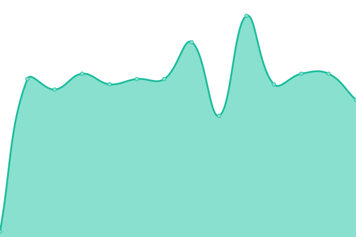 143ms
     
 | 

<a href="https://status.douglasneuroinformatics.ca/history/chat-dnp">100.00%</a>
    

|  [Neurobagel (Alliance FRQS)](https://neurobagel-alliancefrqs.douglasneuroinformatics.ca) | 🟩 Up | [neurobagel-alliance-frqs.yml](https://github.com/DouglasNeuroInformatics/upptime/commits/HEAD/history/neurobagel-alliance-frqs.yml) | 

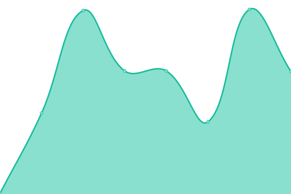 346ms
     
 | 

<a href="https://status.douglasneuroinformatics.ca/history/neurobagel-alliance-frqs">100.00%</a>
    

|  [DNP's LimeSurvey](https://survey.douglasneuroinformatics.ca/) | 🟩 Up | [dnp-s-lime-survey.yml](https://github.com/DouglasNeuroInformatics/upptime/commits/HEAD/history/dnp-s-lime-survey.yml) | 

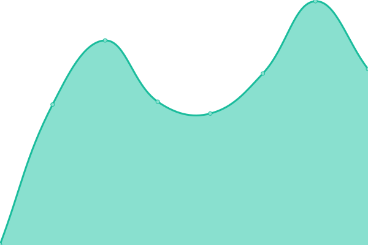 440ms
     
 | 

<a href="https://status.douglasneuroinformatics.ca/history/dnp-s-lime-survey">100.00%</a>
    

|  [MCMP's Omero Server](https://omero.mcmpdouglas.ca/) | 🟩 Up | [mcmp-s-omero-server.yml](https://github.com/DouglasNeuroInformatics/upptime/commits/HEAD/history/mcmp-s-omero-server.yml) | 

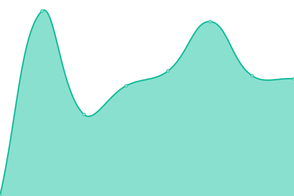 1074ms
     
 | 

<a href="https://status.douglasneuroinformatics.ca/history/mcmp-s-omero-server">100.00%</a>
    

|  SMRC's  REDCap | 🟥 Down | [smrc-s-red-cap.yml](https://github.com/DouglasNeuroInformatics/upptime/commits/HEAD/history/smrc-s-red-cap.yml) | 

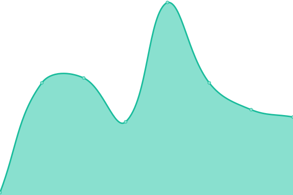 183ms
     
 | 

<a href="https://status.douglasneuroinformatics.ca/history/smrc-s-red-cap">99.99%</a>
    

<!--end: status pages-->

[**Visit our status website →**](https://status.douglasneuroinformatics.ca/)

## 📄 License

- Powered by: [Upptime](https://github.com/upptime/upptime)
- Code: [MIT](./LICENSE) © [Anand Chowdhary](https://anandchowdhary.com), supported by [Pabio](https://pabio.com)
- Data in the `./history` directory: [Open Database License](https://opendatacommons.org/licenses/odbl/1-0/)
